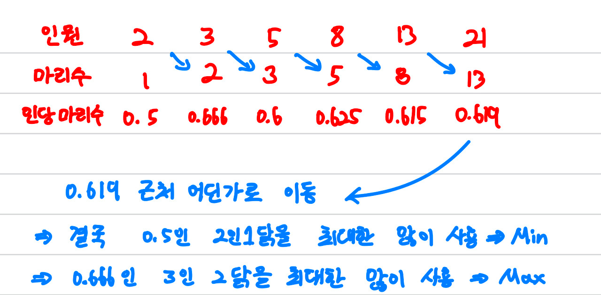

# \[Silver II\] 피보나치 치킨 - 13270

[문제 링크](https://www.acmicpc.net/problem/21937)

### 알고리즘 분류

DP

### 나의 접근법

나는 우선 DP에 대해서 잘 몰랐기 때문에 수학적으로 접근했다.  
인당 마리수는 정해져 있으니 이를 통해 접근하면 되겠다는 생각을 했다.  
아래 그림에서 볼 있듯 인당 치킨 마리수를 구해보면 2인1닭이 가장 적고 3인2닭이 가장 많다.  
따라서 2인1닭을 가장 많이 사용하면 min이 될 것이고 3인2닭을 가장 많이 사용하면 max가 될 것 이다.



#### min

input이 홀수면 2인1닭만 사용하는 경우 1명이 남는다.  
이경우 2인1닭을 사용하지 못하고 3인2닭을 1개 사용해야 한다.  
따라서 짝수인 경우와 홀수인 경우를 나눠서 구해준다.

```
if(input%2 == 0){
    min = input/2;
}else{
    min = (input-3)/2 + 2;  //2인1닭을 하나 빼고 3인2닭 하나 추가
}
```

#### max

max인 경우 3인2닭을 최대한 많이 사용해야 하기 때문에 3으로 나눴을 때 나머지를 기준으로 나눈다.  
나머지가 0이면 3인2닭만 사용한다.  
나머지가 1이면 3인2닭을 1개빼고 2인1닭을 2개 사용한다.  
나머지가 2이면 3인2닭을 사용하고 2인1닭을 1개 사용한다.

```
if(input%3 == 0){   //나누어 떨어지면 3인2닭만 사용
    max = input/3*2;
}else if(input%3 == 1){
    max = (input-4)/3*2 + 2;
}else{
    max = input/3*2 + 1;
}
```

### 알게된 점

이 문제의 의도는 DP식으로 풀라는 것이었다.  
나도 처음에 DP스럽게 풀 수 있을 것 같은데? 라는 생각을 했지만 실패했다.  
결국 정답을 참고했지만 사고 방식을 연습해보았다.  
DP는 기억하기 알고리즘이라고도 하는데 여기서 기억해야할 것이 무엇일까?

#### input이 6인경우

1인메뉴는 없기 때문에 2인+4인 또는 3인+3인의 조합으로 시킬 수 있다.  
min을 구할 땐 2인+4인 의 최소값과 3인+3인의 최소값을 구하면 된다.  
2인+4인 최소값을 구할땐 4인의 최솟값을 알아햐는데 이를 4인의 min을 구할때 배열에 따로 기억해두는 것이다.

한마디로 2부터 input까지 수를 늘려가며 최소값을 기억해두는 것이다.  
input이 피보나치 수열의 수인 경우 해당 수가 min이 될 수도 있다.  
따라서 미리 배열을 초기화 한 후 피보나치 수는 추가로 넣어두고 비교한다.

### 전체 코드

DP식

```
#include <iostream>
#include<algorithm>
using namespace std;


int main() {
    int input;
    cin >> input;

    int dp[10000 + 1][2];
    for(int i=0; i<=input; i++){
        dp[i][0] = 1e9;
        dp[i][1] = 0;
    }

    dp[2][0] = 1, dp[2][1] = 1;
    dp[3][0] = 2, dp[3][1] = 2;
    int a = 2, b = 3;
    while(a+b <= input){
        dp[a+b][0] = dp[a][0] + dp[b][0];
        dp[a+b][1] = dp[a][1] + dp[b][1];
        b += a;
        a = b - a;
    }

    for(int i=4; i<=input; i++){
        for(int j=2; j <= i/2; j++){
            dp[i][0] = min(dp[i][0], dp[j][0] + dp[i-j][0]);
            dp[i][1] = max(dp[i][1], dp[j][1] + dp[i-j][1]);
        }
    }

    printf("%d %d", dp[input][0], dp[input][1]);
    return 0;
}
```

내방식

```
#include <iostream>
using namespace std;

int main(){
    int arr[100000];

    int input;
    cin >> input;

    int max=0, min=0;
    if(input%2 == 0){
        min = input/2;
    }else{
        min = (input-3)/2 + 2;
    }

    if(input%3 == 0){
        max = input/3*2;
    }else if(input%3 == 1){
        max = (input-4)/3*2 + 2;
    }else{
        max = input/3*2 + 1;
    }
    cout << min << " " << max;

    return 0;
}
```