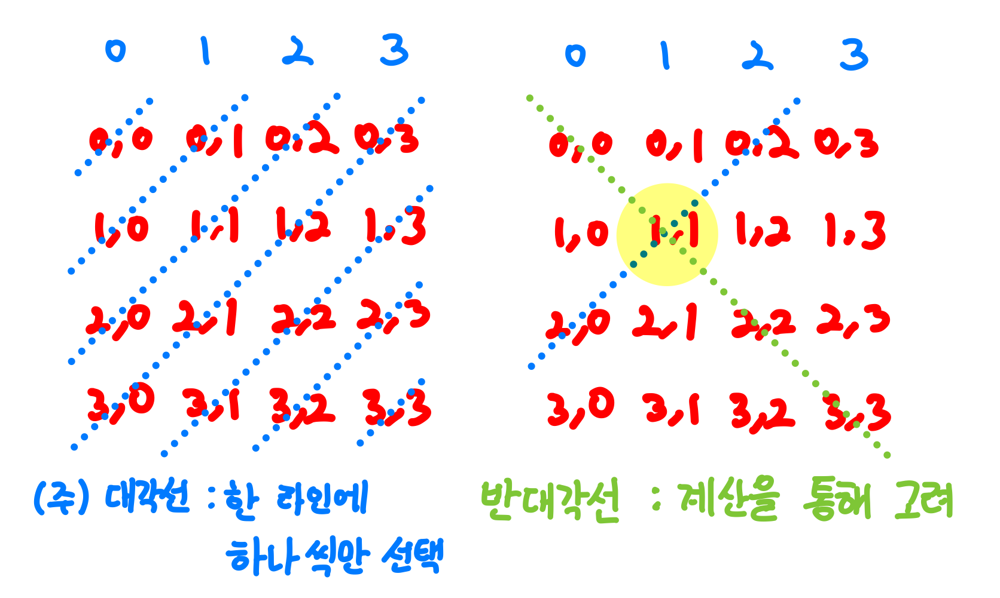
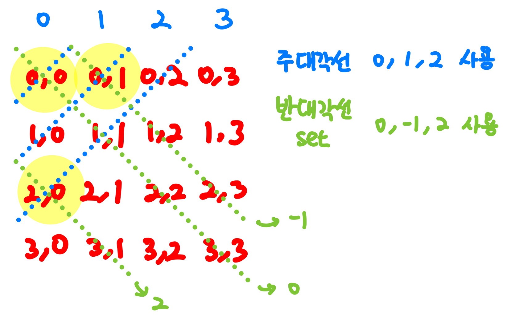
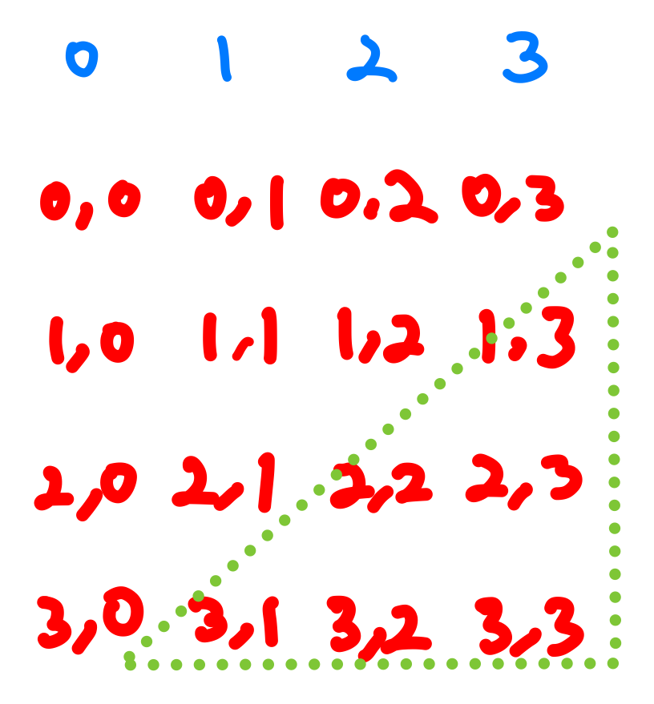

 [문제 링크](https://www.acmicpc.net/problem/1799)

## 알고리즘 분류
---
백트래킹

## 알게된 점
---
아이디어는 금방 떠올랐는데 구현이 너무너무 힘들었다

아직 실력이 많이 부족한가보다.

## 나의 접근 방법
---
우선 기본적인 아이디어의 원리는 아래와 같다.
1. **하나의 (주)대각선에서 하나의 칸에만 비숍**을 놓을 수 있다.
2. 비숍을 놓은 칸과 같은 **반대각선에 있는 칸에는 비숍을 놓을 수 없다**.
	- 반대각선이란 주대각선과 지각을 이루는 대각선을 말합니다.

그림을 보면서 이해하면 좀 더 쉬울 것 같다.



위의 그림처럼 (주)대각선에는 한 라인에 하나씩만 들어갈 수 있다. 따라서, 하나씩 놓아보며 모든 경우를 해보고 최대값을 구하면 된다.

하지만 그림처럼 반대각선도 고려해줘야한다. 반대각선은 규칙을 통해서 구할 수 있다. 현재 그림과 같은 상황에서는, **(x좌표-y좌표)가 동일한 칸들이 같은 반대각선**에 놓여져 있다. 이 경우를 필터링해서 백트래킹으로 시간을 줄일 수 있다.

이 문제는 두가지 경우가 존재한다. 그 이유는 (주)대각선의 방향이 두 방향이기 때문이다. '/' 방향과 '\\'방향이 존재한다.

우선 '/'방향을 기준으로 생각해보자. (0, 0)을 시작으로 놓는 경우와 놓지 않는 경우를 따져본다. 대각선을 논외로 비숍자체를 못놓는 곳도 생각해야한다. 우리는 **놓을 수 있는 최대 비숍수**를 구하고 있다. (주)대각선에는 하나의 비숍만을 놓을 수 있기때문에 놓지 않고 다음 대각선으로 넘어간다면 이는 최대가 아니게 된다.

따라서, **놓을 수 있는 곳에는 무조건 놓는 것이 최대값이 된다.**

그럼 반대각선은 어떻게 구현할 수 있을까? 나는 set을 활용했다. **(x좌표 - y좌표)의 값이 set에 존재**한다면 해당 반대각선은 **사용된 반대각선**인 것이다.



그림의 예시를 보면 이해가 좀 더 쉬울 것이다. 주대각선은 y좌표를 기준으로 이름을 붙여줬다. 현재 주대각선을 2까지 사용한 상황이고 반대각선은 0, -1, 2를 사용한 상황이다. 

다음으로 주대각선 3에서 칸을 고른다면 **해당 칸의 반대각선이 사용되지 않은 상태**여야한다.   
예를 들어, 주대각선 3에서 2,2를 고르려고 한다고 생각해보자. **2-2 = 0 이고 반대각선 set에 0이 있기 때문**에 고를 수 없게 된다.

만약, **주대각선에서 고를 수 있는 칸이 없다면?** 다음 주대각선으로 넘어가야한다. 모든 칸에 놓을 수 없는 상황은 고르지 않는 것이 최선이기 때문이다.

**'\\'방향도 고려해야한다.** 이 경우, 주대각선과 반대각선을 구하는 방법이 달라진다. 반대각선을 구하는 방법은 (x좌표 + y좌표)가 된다. 이 점을 유의하여 구현해야한다.

구현할 때 또한가지 주의할 점이 있다. 일반적인 규칙을 생각하고 구현했다가 아래쪽 절반을 놓치는 경우가 있다.



세모친 아래쪽 절반도 고려하며 구현해야한다.

### 구현시 어려움
---
솔직히 왼쪽 위에서 시작하는 것과 오른쪽 위에서 시작하는 경우를 나누어 함수를 두개 만들 수도 있었다. 하지만 이건 멋이 없기 때문에 하나의 함수로 만들어 보았다.

1. 왼쪽 위에서 시작하는 경우
	- dir = -1
2. 오른쪽 위에서 시작하는 경우
	- dir = 1

위와 같이 설정한 이유는 하나의 주대각선에서 칸을 순회할 때 나타나는 특징 때문이다. 왼쪽 위에서 시작한 경우, 주대각선에서 y좌표가 1씩 줄어든다. 반대로 오른쪽 위에서 시작한 경우 주대각선에서 y좌표가 1씩 늘어난다. 
(하나의 주대각선에 포함된 칸을 순회할 때 해당하는 말이다.)

## 코드
---

```cpp
#include <bits/stdc++.h>
using namespace std;

int n;
int arr[10][10];
set<int> usedDif;
int result;

bool canUse(int stCol, int dir) {

    int edge = dir == -1 ? -1 : n;
    for(int cx = 0, cy = stCol; cy != edge; cx++, cy += dir){
        int dif = dir == -1 ? cx - cy : cx + cy;
        
        if(cx < 0 || cx >= n || cy < 0 || cy >= n) continue;
        //둘 수 있고 반대각선이 안쓰였다면
        if(arr[cx][cy] && usedDif.find(dif) == usedDif.end()) return true;
    }

    return false;
}

void back(int stCol, int dir, int count) {
    //
    if(stCol == 2*n - 1 || stCol == - n) {
        result = max(result, count);
        return;
    } 

    //해당 대각선에 사용할 수 있는 칸이 하나도 없으면 다음 대각선
    if(!canUse(stCol, dir)) {
        back(stCol-dir, dir, count);
        return;
    }

    int edge = dir == -1 ? -1 : n;
    //dir은 col에 더해지는 수
    //왼쪽 위 시작일 때는 -1, 오른쪽 위 시작일때는 +1
    for(int cx = 0, cy = stCol; cy != edge; cx++, cy += dir){
        int dif = dir == -1 ? cx - cy : cx + cy;
        
        if(cx < 0 || cx >= n || cy < 0 || cy >= n) continue;
        //못두는 곳이거나 이미 쓰인 반대각선이면
        if(!arr[cx][cy] || usedDif.find(dif) != usedDif.end()) continue;

        usedDif.insert(dif);
        back(stCol-dir, dir, count+1);
        usedDif.erase(dif);
    }

}

int main(){

    cin >> n; 
    for(int i=0; i<n; i++){
        for(int j=0; j<n; j++){
            cin >> arr[i][j];
        }
    }
    result = 0;
    back(0, -1, 0);
    back(n-1, 1, 0);
    
    cout << result;

    return 0;
}
```