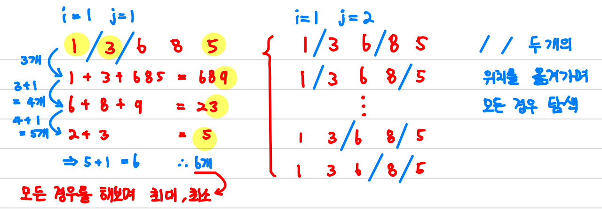

# [Gold V] 홀수 홀릭 호석 - 20164
[문제 링크](https://www.acmicpc.net/problem/20164)

### 알고리즘 분류
구현, (완전탐색?)

### 나의 접근법
처음엔 그리디스럽게 풀어야 한다고 생각했음   
현재에서 홀수가 가장 많이 나올 수 있도록 (or 가장 적도록) 뽑아내야한다고 생각함   
하지만 현재의 선택이 다음 선택에 영향을 미친다는 것을 알게됨

예를 들어 100인 경우,
- 첫번째 경우   
2211 -> 1개 
22 + 11 -> 33 -> 2개   
3 + 3 -> 6 -> 0개   
총 3개
- 두번째 경우   
2201 -> 1개   
220 + 1 -> 221 -> 1개    
22 + 1 -> 23 -> 2개   
2 + 3 -> 5 -> 1개   
총 4개

위의 경우 처럼 첫번째 단계에서 가장 홀수를 많이 얻을 수 있는 경우(첫번째 경우)를 선택 하였지만   
총 개수에서는 두번째 경우가 더 많은 것을 볼 수 있음   

따라서 모든 경우를 따져본 후 최대 개수와 최소개수를 정해야 함   
수의 길이가 3이상인 경우 모두 같은 방식으로 동작하기 때문에 재귀로 풀면 쉬울 것 같다고 생각함

입력값을 잘라서 사용하기 때문에 숫자보다는 문자열 또는 배열로서 다루면 되겠다고 생각함   

시간 복잡도를 따져봤을 때 입력값이 '1억-1' 이지만 문자열로 보면 길이가 8이기 때문에   
완전 탐색을 하여 O(n^2)이더라도 64밖에 나오지 않아 충분하다고 생각함   

#### 재귀함수
```c++
void findLoop(int a, int count){
    int nowHorse = horse(to_string(a));
    //숫자가 두자리인 경우
    if(a <= 99 && a >= 10){
        findLoop(a/10 + a%10 , count + nowHorse);
    }
    //숫자가 한자리 인 경우
    else if(a < 10){
        count += a%2;
        if(count < minInt) minInt = count;
        if(count > maxInt) maxInt = count;
    }
    //숫자가 세자리 이상인 경우
    else{
        string temp = to_string(a);
        for(int i=1; i<=temp.length()-2; i++){
            for(int j=1; j<=temp.length()-i-1; j++){
                // i와 j에 따라서 자른후 더하기
                int next = stoi(temp.substr(0,i)) + stoi(temp.substr(i, j)) + stoi(temp.substr(i+j, temp.length()-i-j));
                // 자른 수와 현재까지의 합을 전달
                findLoop(next, count +  nowHorse);
            }
        }
    }
}
// 홀수의 개수 구하는 함수
int horse(string str){
    int count = 0;
    for(int i=0; i<str.length(); i++){
        if( (int)str[i]%2 == 1) count++;
    }
    return count;
}
```
숫자가 두자인 경우와 한자리인 경우는 경우의 수가 1개 뿐이라 어렵지 않게 구현할 수 있음   
숫자가 세자리인 경우 조금 어려울 수 있음. 아래의 그림을 보면 조금 더 이해를 쉽게 할 수 있음   



위의 그림처럼 재귀함수에 들어가게 되면 이중반복문으로 '/' 를 옮겨가며 모든 조합을 따져봄   
다음 재귀함수에 현재까지의 홀수의 개수를 전달함   
최종적으로 i<10 조건문에 들어가면 홀수의 개수가 정해지므로 max와 min을 비교함

### 알게된 점
확실히 재귀 문제는 탈출지점과 해야할 일들을 확실히 설계 후 코드를 짜기 시작해야겠다고 생각함   

처음에 알고리즘을 떠올리고 어떻게 max를 알아낼 지도 알았지만 잘못된 부분에 코드를 삽입해 고난에 빠졌음   
문자열로 풀면 쉽겠다라고 떠올리는 문제는 많은데 관련 메소드를 몰라서 도전하지 못하는 경우가 많았음   

조금 더 문자열 관련 메소드를 연습하고 공부해야겠다고 생각함

이번 문제는 시간문제에서 어렵지 않았지만 코드를 짜기전에 시간복잡도를 계산해보고 시작해야겠다고 생각함

### 전체코드
```c++
//
// Created by 정원영 on 11/27/23.
//

#include <iostream>
#include <string>
using namespace std;

int input;
int maxInt = 0, minInt = 100000000;
void findLoop(int a, int count);
int horse(string str);

int main(){
    cin >> input;
    findLoop(input, 0);
    cout << minInt << " " << maxInt;

    return 0;
}

void findLoop(int a, int count){
    int nowHorse = horse(to_string(a));
    //숫자가 두자리인 경우
    if(a <= 99 && a >= 10){
        findLoop(a/10 + a%10 , count + nowHorse);
    }
    //숫자가 한자리 인 경우
    else if(a < 10){
        count += a%2;
        if(count < minInt) minInt = count;
        if(count > maxInt) maxInt = count;
    }
    //숫자가 세자리 이상인 경우
    else{
        string temp = to_string(a);
        for(int i=1; i<=temp.length()-2; i++){
            for(int j=1; j<=temp.length()-i-1; j++){
                int next = stoi(temp.substr(0,i)) + stoi(temp.substr(i, j)) + stoi(temp.substr(i+j, temp.length()-i-j));
                findLoop(next, count +  nowHorse);
            }
        }
    }
}

int horse(string str){
    int count = 0;
    for(int i=0; i<str.length(); i++){
        if( (int)str[i]%2 == 1) count++;
    }
    return count;
}

```