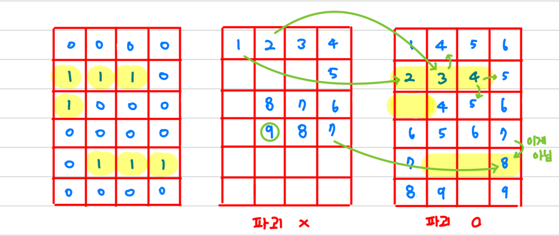

# [Gold III] 벽 부수고 이동하기 - 2206

[문제 링크](https://www.acmicpc.net/problem/2206)

### 알고리즘 분류
BFS

### 알게된 점
대차게 실패함   
이전에는 보지 못한 문제유형이라 나중에 한번 더 풀어보면 좋을 것 같음    
벽을 여러번 부술 수 있는 경우도 생각해보면 좋을 것 같음

### 나의 접근법
흔히 최단거리를 구할 때는 다익스트라 알고리즘을 사용함    
그래서 당연히 BFS로 풀면 되겠다고 생각함 

그런데 벽을 한번 부술 수 있다는 기가 막힌 조건이 달림   
근데 한번이니까 벽 하나씩 없애고 BFS돌리면 되겠다고 생각함    
하지만 아니나 다를까 시간초과

도저히 방법이 떠오르지 않아 1시간 30분째 아이디어를 찾아봄   
오... 이 문제는 나의 두뇌로는 풀 수 없다는걸 알게됨   

### 풀이
기본적으로 두개의 dist배열을 만들면 됨   
1. 벽을 한번도 파괴하지 않은 배열
   - 벽을 만나면 파괴하여 2번 배열로 넘어감
2. 벽을 이미 한번 파괴한 배열
   - 벽을 만나면 continue 해버림

풀이의 단계는 아래와 같음
1. 벽 파괴 x 배열의 (0, 0) 에서 시작
2. 벽이 없으면 일반 다익스트라 처럼 진행
3. 벽을 만나면 벽 파괴 O 배열로 넘어가서 다익스트라를 진행
4. 벽 파괴 O 배열로 넘어간면 벽을 만날경우 continue함
5. 벽 파괴 X 배열이든 벽 파괴 O 배열이든 (n-1, m-1) 을 만나면 리턴

아래의 그림을 보면 좀 더 이해가 쉬울 듯 함



1. (0, 0)에서 시작하여 아래와 오른쪽을 만남 (4방향으로 나아가면 됨)
   - 오른쪽의 경우 길 -> 파괴 X 배열에 2 입력 
   - 아래의 경우 벽임 -> 현재 파괴 X 배열 -> 벽 파괴 O 배열 (1, 0)에 1+1 -> 2
     - 벽을 파괴하고 나아간다는 의미에서 파괴 O 배열에 입력하는 것
2. 오른쪽과 아래의 경우 다르게 행동함
   - 오른쪽은 벽을 파괴한 적이 없기에 계속 똑같이 위의 과정을 반복함 (파괴 X의 (0, 1))
   - 아래의 경우 오른쪽과 아래, 총 벽 2개를 만남 -> 이미 벽 파괴 0 배열이므로 벽 파괴 불가
     - 파괴 O (1, 0)에 의해서 큐에 push되는 건 없음
     - 파괴 O (1, 1)에 있는 3은 파괴 X (0, 1)에 의해 입력된 것


### 코드
```c++
##include <bits/stdc++.h>
using namespace std;

int main(){
  ios::sync_with_stdio(false); cin.tie(0);
  int n, m;
  cin >> n >> m;

  int arr[1000][1000];
  int dist[1000][1000][2];
  int dx[4] = {-1, 0, 1, 0};
  int dy[4] = {0, -1, 0, 1};
  char input;
  
  for(int i=0; i<n; i++){
    for(int j=0; j<m; j++){
      cin >> input;
      arr[i][j] = input - '0';
      dist[i][j][0] = dist[i][j][1] = -1; 
    }
  }


  dist[0][0][0] = dist[0][0][1] = 1;
  queue<tuple<int, int, int > >q;
  q.push({0, 0, 0});
  while(!q.empty()){
    int x, y, broken;
    tie(x, y, broken) = q.front(); q.pop();
    
    if(x == n-1 && y == m-1){
      cout << dist[x][y][broken];
      return 0;
    }
    
    for(int i=0; i<4; i++){
      int nx = x + dx[i], ny = y + dy[i];
      if(nx < 0 || nx >= n || ny < 0 || ny >= m) continue;
      //길이고 지나간적 없을 때
      if(arr[nx][ny] == 0 && dist[nx][ny][broken] == -1){
        dist[nx][ny][broken] = dist[x][y][broken] + 1;
        q.push({nx, ny, broken});
      }

      //벽인데 벽 부슨적 없을 때
      if(arr[nx][ny] == 1 && !broken && dist[nx][ny][1] == -1){
        dist[nx][ny][1] = dist[x][y][broken] + 1;
        q.push({nx, ny, 1});
      }
    }
  }

  cout << -1;

  return 0;
  
}
```
