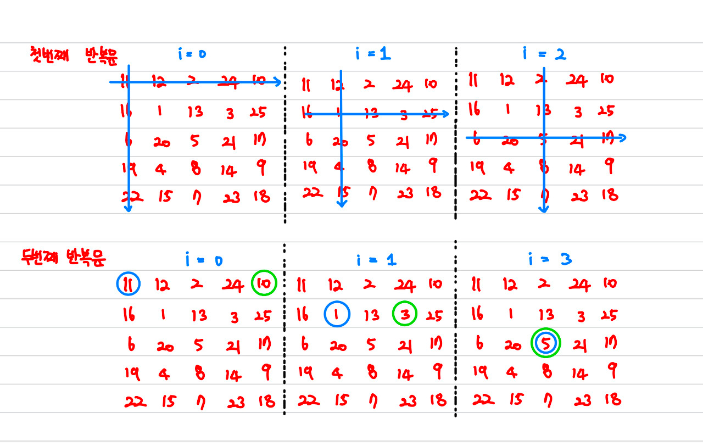

# [Silver IV] 빙고 - 2578

[문제 링크](https://www.acmicpc.net/problem/2578)

### 알고리즘 분류

구현

### 나의 접근법
빙고 판을 2차원 배열에 넣어두고 X표시를 할 때마다 해당 배열의 값을 0으로 만들어서 표시하고자 함    
매번 X 표시를 할 때마다 빙고의 여부를 확인하는 함수를 호출하여 확인하고자 함   
해당 함수는 일렬로 배치된 5개의 0을 확인한다.   
있다면 빙고의 카운트를 1개 올린 후 총 3개가 넘어간다면 "빙고!"를 외친다.

#### 빙고 확인 함수
```c++
int check(int arr[][5]){
    int count = 0;
    int count1, count2;
    //가로 세로 빙고 체크
    //count1은 가로 count2는 세로 동시 체크
    for(int i=0; i<5; i++){
        count1 = 0 , count2 = 0;
        for(int j=0; j<5; j++){
            if(arr[i][j] == 0) count1++;
            if(arr[j][i] == 0) count2++;
        }
        if(count1 == 5) count += 1;
        if(count2 == 5) count += 1;
    }

    //대각선 빙고 체크
    count1 = 0, count2 = 0;
    for(int i=0; i<5; i++){
        if(arr[i][i] == 0) count1++;
        if(arr[i][4-i] == 0) count2++;
    }
    if(count1 == 5) count += 1;
    if(count2 == 5) count += 1;

    if(count >= 3) return 1;
    else return 0;
}
```
해당 함수는 가로와 세로를 동시에 체크, 대각선을 동시에 체크함   
첫번째 반복문에서 가로와 세로를 동시에 체크함. 아래의 사진을 참고하면 더욱 이해가 편함   
두번째 반복문에서는 대각선을 동시에 체크함. 동일하게 아래의 사진을 참고.



#### 메인 함수
```c++
int main(){
    int arr[5][5];
    for(int i=0; i<5; i++){
        for(int j=0; j<5; j++){
            cin >> arr[i][j];
        }
    }

    int input;
    for(int i=0; i<25; i++){
        cin >> input;
        //배열 전체를 탐색하며 해당 숫자를 찾아 0으로 바꿈
        for(int j=0; j<5; j++){
            for(int k=0; k<5; k++){
                if(arr[j][k] == input){
                    arr[j][k] = 0;
                    j = 5;
                    k = 5;
                }
            }
        }
        //바꿀 때 마다 빙고 확인
        if(check(arr) == 1){
            cout << i+1;
            break; 
        }
    }

    return 0;
}
```
### 알게된 점
사실 구현이라 뭐 알게된 점은 많이 없음  
뭐 모듈화를 잘하면 문제 풀기가 편하다 정도인 것 같음   
초반 설계를 확실히 하고 문제를 풀기 시작하는 것이 가장 중요한 점인듯 함