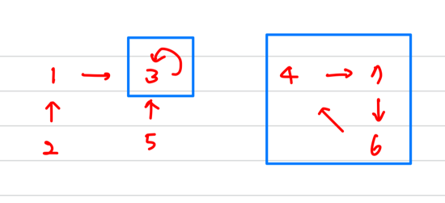
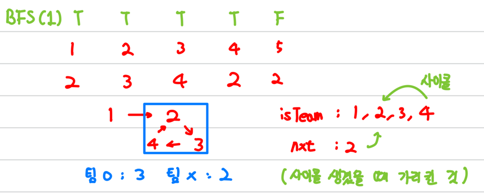

[Gold III] 텀 프로젝트 - 9466

[문제 링크](https://www.acmicpc.net/problem/9466)

### 알고리즘 분류
BFS, DFS

### 나의 접근법
딱 1시간 걸림   
처음에는 그냥 모든 학생을 거치며 BFS를 돌리며 자기자신을 돌아오면 팀이 완성되는 걸로 생각함   
아니나 다를까 그렇게 되면 시간 복잡도가 O(n<sup>2</sup>)이라 시간초과임    
고민을 하다 떠올리게 된게 어차피 한번 보면 팀이 될 애들은 보이겠다 싶었음    
왜냐하면 한번 BFS를 돌때 한팀이 나오기 때문임   
예제를 그림으로 나타내게 되면 아래와 같음



파란색 네모로 나타낸 부분이 팀을 이룬 그룹임  
1에서 시작하든 2에서 시작하든 무조건 한팀은 탐색하게 됨   
그렇기 때문에 매번 visited를 초기화 하지말고 돌자고 생각함   
그러면 팀을 이루지 못한 애들 숫자만 세어주면 된다고 생각함

아래의 그림을 보면 좀 더 이해가 쉬울 것 같음



예를 들어 위와 같은 예시가 있을 때   
BFS(1)을 했을 때 isTeam이라는 벡터에 넣으며 순회를 돔   
그러다가 visited가 true가 나오면 반복문을 탈출함   
즉 사이클이 생겼다는 소리임

이때 isTeam을 통해서 사이클이 생기기 전까지 몇개의 원소가 있었는지 체크함   
이 원소의 개수가 팀을 이루지 못한 것들의 개수임

하지만 이렇게만 개수를 따지기에는 문제가 있음

그다음 경우를 생각해보면 바로 나옴


isTeam에는 5가 들어가 있으나 visited[2]가 true라 사이클 자체가 안생김   
이미 저 사이클은 BFS(1)에서 체크 했기 때문에 중복 체크를 할 필요가 없는 경우임   
이경우 그냥 isTeam에 들어있는 모두가 팀을 못 이룬거임

### 코드
```c++
#include <iostream>
#include <queue>
#include <sstream>
#include <algorithm>
using namespace std;


int main(){
    ios_base::sync_with_stdio(false); cin.tie(NULL);

    int tc;
    cin >> tc;

    int student, cur, nxt, result;
    int arr[100001];
    int visited[100001];

    queue<int> q;
    while(tc--){
        cin >> student;
        for(int i=1; i<=student; i++){
            cin >> arr[i];
            visited[i] = false;
        }


        result = 0;
        vector<int> isTeam;
        for(int i=1; i<=student; i++){
            if(visited[i]) continue;    //이미 지나간 길이면 패스

            //팀을 이룰 수 있는지 체크
            q.push(i);
            cur = i;
            while(true){
                isTeam.push_back(cur);
                visited[cur] = true;
                nxt = arr[cur];
                if(visited[nxt]) break;
                cur = nxt;
            }
            
            //사이클이 있는지 체크
            int idx = -1;
            for(int j=0; j<isTeam.size(); j++){
                if(nxt == isTeam[j]) {
                    idx = j;
                    break;
                }
            }

            if(idx == -1){  //사이클이 없는 경우
                result += isTeam.size();
            }else{      //사이클이 생긴경우
                result += idx;
            }
            isTeam.clear();
        }

        cout << result << "\n";
    }
}

```